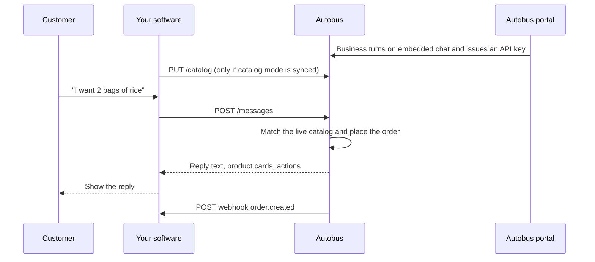

# Embedded chat

Autobus answers your customers and places orders. Your software owns the screen. You send each message to Autobus and show the reply. When an order is placed, Autobus also calls a webhook on your server so you can fulfill it.

Base URL: `https://<your-autobus-host>/api/v1/embed`

## How a turn works



| Direction | Who starts it | What it is for |
| --- | --- | --- |
| Chat | Your software | One customer message in, one reply out |
| Catalog sync | Your software | Push inventory Autobus is allowed to sell |
| Webhook | Autobus | Tell you an order was placed, updated, or a person was requested |

## 1. Turn it on in the portal

On the Autobus **web portal**, open **Settings → Embedded chat**. The mobile app does not manage this integration.

Questions about the business (hours, policies, how you work) are answered from memory you train under **AI Intelligence** on that same web portal. The chat API does not take a dump of business facts on each message. Product prices and stock come from the catalog.

1. Choose a catalog mode.
   - **Managed in Autobus.** Products are entered in the portal. Skip catalog sync.
   - **Synced from your software.** Your system is the source of truth. Push items with `PUT /catalog`.
2. Paste the HTTPS URL that should receive order events, then save.
3. Issue an API key. The full key is shown once. Store it as a secret. The portal keeps only a hash.
4. Turn embedded chat on.

Copy the webhook signing secret from the same screen. You use it to verify that a webhook came from Autobus.

The key is scoped to that business. A call cannot read another business’s catalog.

Send the key on every partner request:

```http
Authorization: Bearer ab_live_...
```

`X-Api-Key: ab_live_...` is accepted as well.

## 2. Catalog

Push this only when catalog mode is **synced**. A managed catalog returns `409`.

`PUT /api/v1/embed/catalog`

```json
{
  "items": [
    {
      "external_id": "SKU-RICE-5",
      "kind": "product",
      "name": "Rice Bag 5kg",
      "description": "Local perfumed rice",
      "price": { "amount": "75.00", "currency": "GHS" },
      "stock": { "tracked": true, "quantity": 40 },
      "category": "Grocery",
      "active": true,
      "image_url": "https://cdn.example.com/rice.jpg",
      "link": "https://shop.example.com/rice"
    },
    {
      "external_id": "SVC-DELIVERY",
      "kind": "service",
      "name": "Same-day delivery",
      "price": { "amount": "20.00", "currency": "GHS" },
      "stock": { "tracked": false },
      "active": true
    }
  ]
}
```

| Field | Required | Meaning |
| --- | --- | --- |
| `external_id` | yes | Your SKU. Later upserts with the same id overwrite the item. |
| `kind` | no | `product` (default) or `service`. |
| `name` | yes | Name the bot is allowed to say and sell. |
| `price.amount` | no | Decimal string. Defaults to 0. The bot quotes this price, not a price from the chat. |
| `price.currency` | no | Display hint. Orders use the business currency configured in Autobus. |
| `stock.tracked` | no | `true` for a counted product. `false` for a service that can always be ordered. |
| `stock.quantity` | when tracked | Integer on hand. `0` means the bot will not sell it. |
| `active` | no | `false` hides the item from the bot and keeps order history. |

Send changes as they happen, and a full snapshot at least once a day. Up to 200 items per request.

`GET /api/v1/embed/catalog` returns the items Autobus currently has for this key.

The bot sells only these rows. Do not attach a product list to the chat message.

## 3. Send a message

`POST /api/v1/embed/messages`

```json
{
  "conversation_id": "thread_441",
  "customer": {
    "external_id": "cust_8841",
    "name": "Ama Mensah",
    "phone": "+233201234567",
    "email": "ama@example.com"
  },
  "message": {
    "id": "msg_91",
    "text": "I want 2 bags of rice"
  }
}
```

| Field | Required | Meaning |
| --- | --- | --- |
| `customer.external_id` | yes | Stable id in your software. This is the conversation key, together with the business. |
| `customer.name` | no | Pre-filled onto the order when the customer has not typed a name. |
| `customer.phone` | no | Pre-filled onto the order. The bot asks when an order needs a phone and you did not send one. |
| `conversation_id` | no | Your thread id. Copied onto the order and the webhook. |
| `message.id` | yes | Your id for this turn. Retries of the same id return the original response and do not place a second order. |
| `message.text` | yes | What the customer said. |

Response:

```json
{
  "conversation_id": "thread_441",
  "reply": {
    "text": "Order placed for 2 x Rice Bag 5kg at GHS 75.00 each. Order number: ORD-20260925-10421. Total: 150.00 GHS.",
    "products": [
      {
        "external_id": "SKU-RICE-5",
        "product_id": "…",
        "kind": "product",
        "name": "Rice Bag 5kg",
        "description": "Local perfumed rice",
        "price": "75.00",
        "currency": "GHS",
        "stock": 38,
        "active": true,
        "category": "Grocery"
      }
    ]
  },
  "actions": [
    {
      "type": "order.created",
      "order": {
        "order_id": "…",
        "order_number": "ORD-20260925-10421",
        "source": "embed",
        "external_customer_id": "cust_8841",
        "conversation_id": "thread_441",
        "items": [
          {
            "external_id": "SKU-RICE-5",
            "name": "Rice Bag 5kg",
            "quantity": 2,
            "unit_price": "75.00"
          }
        ],
        "total": "150.00",
        "currency": "GHS",
        "status": "pending",
        "payment_status": "pending",
        "fulfillment_status": "unfulfilled"
      }
    }
  ]
}
```

Show `reply.text` to the customer. Render `reply.products` as cards when you want. Treat `actions` as the machine result.

`actions` is empty when the bot only answered. `conversation.handoff` is added when the customer asks for a person and handoff is enabled.

Payment stays in your software. The order is created unpaid. The same order appears in the Autobus portal.

## 4. Receive webhooks

Autobus `POST`s to the URL you saved. The body is JSON:

```json
{
  "id": "evt_…",
  "type": "order.created",
  "created_at": "2026-09-25T00:40:00Z",
  "data": {}
}
```

| Header | Meaning |
| --- | --- |
| `X-Autobus-Event` | `order.created`, `order.updated`, `conversation.handoff`, or `catalog.sync_failed` |
| `X-Autobus-Signature` | `sha256=` plus HMAC-SHA256 of the raw body, using your webhook secret |

Verify the signature against the raw bytes before you parse JSON. Reject anything that does not match.

`order.created` and `order.updated` put the order object in `data`. `catalog.sync_failed` puts `{ "failed": [...], "upserted_count": 1 }` in `data`. Respond with HTTP 2xx. Autobus does not retry a failed delivery in this version, so keep the synchronous `actions` array as the source you act on immediately, and use the webhook as the copy your backend stores.

## 5. Update an order

After you take payment or ship, tell Autobus:

`POST /api/v1/embed/orders/{order_number}`

```json
{
  "payment_status": "paid",
  "fulfillment_status": "fulfilled",
  "payment_reference": "TXN-12345"
}
```

Allowed values:

- `payment_status`: `pending`, `paid`, `partial`, `refunded`, `failed`
- `fulfillment_status`: `unfulfilled`, `partial`, `fulfilled`, `shipped`, `delivered`
- `order_status`: `pending`, `processing`, `confirmed`, `cancelled`, `completed`

Autobus then sends `order.updated`.

## Errors

| HTTP | When |
| --- | --- |
| 401 | Missing or unknown API key, or embedded chat is off |
| 400 | A required chat or catalog field is missing or invalid |
| 404 | Order number is not on this business |
| 409 | Catalog push while mode is still managed in the portal |

## Minimal loop

```http
PUT /api/v1/embed/catalog
Authorization: Bearer ab_live_...

POST /api/v1/embed/messages
Authorization: Bearer ab_live_...
```

Store `message.id` before you call, so a timeout retry is safe. If `actions` contains `order.created`, record `order.order_number` and `items[].external_id` in your system, then fulfill. When payment completes, `POST` the order update.
